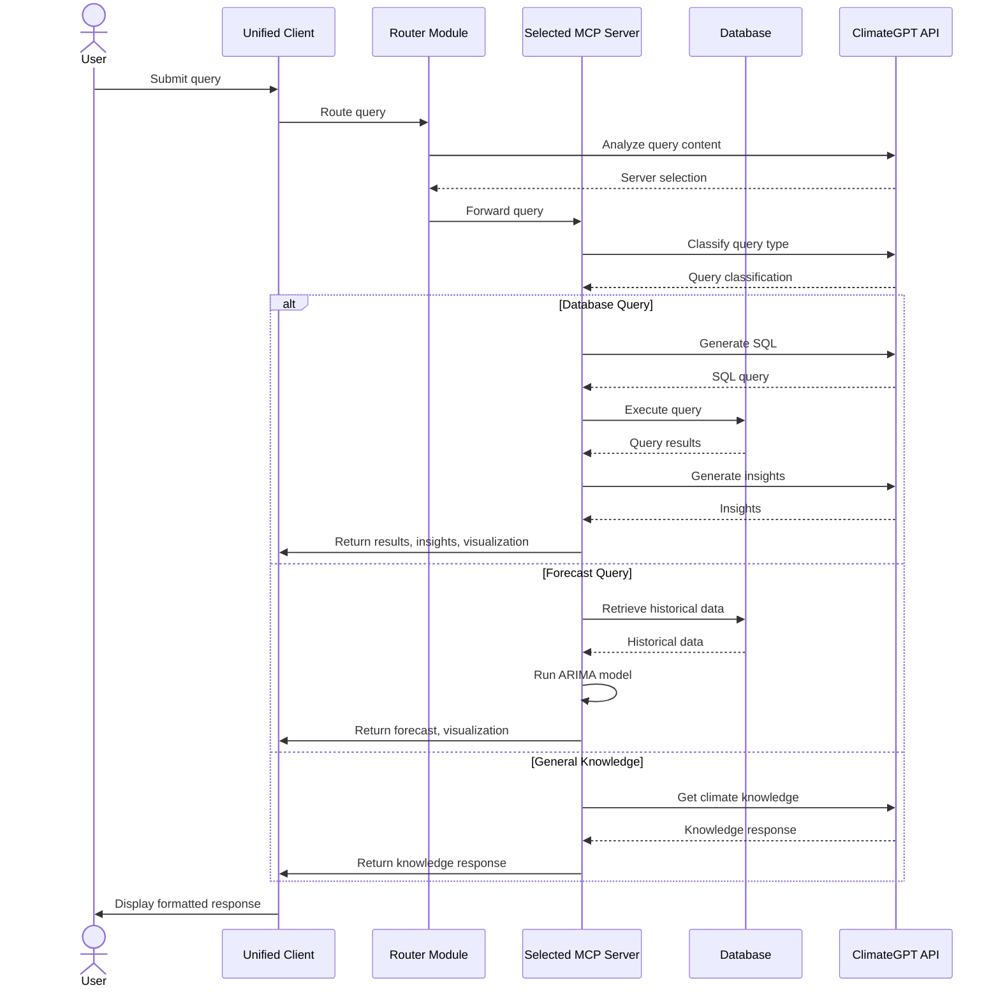

# ClimateGPT Technical Architecture

This document describes the technical architecture of the ClimateGPT system, intended for developers and technical stakeholders.

## System Overview

ClimateGPT is a distributed system built on Model Context Protocol (MCP) architecture with multiple specialized servers and a central routing mechanism.

```
                                        ┌─────────────────────┐
                                   ┌───▶│ Emissions MCP Server│
                                   │    └─────────────────────┘
┌─────────────┐    Query    ┌──────┴───┐
│  Unified    │───Routing──▶│  Router  │    ┌─────────────────────┐
│   Client    │◀────────────|  Module  │───▶│ Sea Level MCP Server│
└─────────────┘             └──────┬───┘    └─────────────────────┘
                                   │
                                   │    ┌─────────────────────┐
                                   └───▶│ Wildfires MCP Server│
                                        └─────────────────────┘
```

## Core Components

The system comprises four main components, each with distinct responsibilities:

### 1. Specialized MCP Servers

Three specialized servers, each dedicated to a specific climate data domain:

- **Emissions Server**: Processes greenhouse gas emissions queries
- **Sea Level Server**: Handles sea level data analysis
- **Wildfires Server**: Manages wildfire occurrence data

Each server implements the MCP architecture, providing a tool-based interface for processing queries.

### 2. Unified Client

A command-line interface that provides a consistent user experience across all servers, featuring:

- Rich text formatting
- Interactive command processing
- Visualization rendering
- Server selection via the router

### 3. Router Module

The intelligent routing system that:

- Analyzes query content
- Selects the appropriate specialized server
- Directs queries to the selected server
- Manages server connection and failover

### 4. External ClimateGPT API

An external LLM API service that provides:

- Query classification
- SQL generation
- Insight extraction
- Execution planning

## Data Flow Architecture

The system follows a request-response pattern with intelligent routing:

1. User submits a query to the unified client
2. Router analyzes the query and selects a server
3. Selected server processes the query using MCP
4. Server returns results to the client
5. Client formats and displays the results

### Sequence Diagram



## MCP Architecture

The MCP (Model Context Protocol) architecture forms the foundation of the system:

### Tool-Based Approach

Each server exposes a set of tools through the MCP framework:

```python
@server.list_tools()
async def handle_list_tools() -> list[types.Tool]:
    """Lists available tools."""
    return [
        types.Tool(
            name="query-database",
            description="Generate and execute a SQL query on the climate database.",
            inputSchema={
                "type": "object",
                "properties": {
                    "query": {"type": "string", "description": "User's natural language query"}
                },
                "required": ["query"],
            },
        ),
        types.Tool(
            name="get-database-stats",
            description="Get statistics about the climate database.",
            inputSchema={
                "type": "object",
                "properties": {},
            },
        )
    ]
```

### Execution Flow

1. **Tool Selection**: The MCP server selects the appropriate tool based on query needs
2. **Parameter Passing**: Input parameters are validated against the tool's schema
3. **Tool Execution**: The tool function is called with the validated parameters
4. **Response Formatting**: Results are formatted according to MCP specifications

### Benefits of MCP Architecture

- **Modularity**: Tools can be added, removed, or modified independently
- **Type Safety**: Input validation with JSON Schema prevents type errors
- **Extensibility**: New capabilities can be added without changing core logic
- **Standardization**: Consistent interface across all servers

## Database Architecture

### Emissions Database Schema

Star schema design with fact and dimension tables:

- **Fact Table**: `Emissions` (emission records)
- **Dimension Tables**: `Greenhouse_Gases`, `Sectors`, `Geography`, `Fuels`

```
┌───────────────┐     ┌─────────────────┐
│Greenhouse_Gases│←───┤                 │
└───────────────┘     │                 │
                      │                 │
┌───────────────┐     │                 │
│    Sectors     │←───┤                 │
└───────────────┘     │                 │
                      │    Emissions    │
┌───────────────┐     │                 │
│   Geography    │←───┤                 │
└───────────────┘     |                 |
                      |                 |   
┌───────────────┐     |                 |
│     Fuels      │←───|                 |
└───────────────┘     └─────────────────┘
```                      


### Query Processing

The database layer implements:

1. **Query Generation**: ClimateGPT API generates optimized SQL
2. **Schema Enforcement**: Validation against schema to prevent errors
3. **Query Execution**: Safe execution with timeouts and retry logic
4. **Result Processing**: Conversion to standard format for client display
5. **Caching**: In-memory caching of query results for performance

## API Interfaces

### Server API Endpoints

Each server exposes RESTful endpoints:

- `POST /query` - Process natural language queries
- `GET /stats` - Get server statistics
- `POST /visualization` - Generate visualizations
- `POST /cache/purge` - Clear cache

### MCP Interface

The MCP interface provides:

- `list_tools()` - List available tools
- `call_tool()` - Execute a specific tool with parameters

## Advanced Features

### Forecasting System

The emissions server includes ARIMA-based forecasting:

1. **Data Preprocessing**: Clean data and handle missing values
2. **Parameter Selection**: Automatic selection of optimal (p,d,q) parameters
3. **Model Training**: Fit ARIMA model to historical data
4. **Forecast Generation**: Project future values with confidence intervals
5. **Visualization**: Generate forecast plots with historical comparison

### Visualization System

The visualization module:

1. **Analysis**: Determine appropriate visualization type
2. **Code Generation**: Create matplotlib code for visualization
3. **Rendering**: Client-side execution of visualization code

## Deployment Architecture

### Standard Deployment

The standard deployment architecture uses Python's built-in capabilities:

```
┌─────────────────────────────────────────────────────────┐
│                     Host Machine                        │
│                                                         │
│  ┌─────────────┐    ┌─────────────┐    ┌─────────────┐  │
│  │ Emissions   │    │ Sea Level   │    │ Wildfires   │  │
│  │ Server      │    │ Server      │    │ Server      │  │
│  │ (Port 8000) │    │ (Port 8001) │    │ (Port 8002) │  │
│  └─────────────┘    └─────────────┘    └─────────────┘  │
│                                                         │
│  ┌─────────────┐                                        │
│  │ Unified     │                                        │
│  │ Client      │                                        │
│  └─────────────┘                                        │
└─────────────────────────────────────────────────────────┘
```

### Query Optimization

- **Schema Analysis**: Use database schema for optimized query generation
- **Query Planning**: Multi-step execution for complex queries
- **Timeout Management**: Graceful handling of long-running queries

## Security Considerations

- **Input Validation**: Sanitize all user input to prevent injection attacks
- **API Security**: Environment-based credential management
- **Error Handling**: Safe error messages that don't reveal system details
- **Logging**: Comprehensive logging with sensitive data protection

## Error Handling

The system implements robust error handling:

- **Retries**: Automatic retry for transient errors with exponential backoff
- **Fallbacks**: Graceful degradation when components fail
- **Monitoring**: Error tracking and alerting
- **Recovery**: Self-healing mechanisms for common failure modes

## Monitoring and Logging

- **Log Consolidation**: Centralized logging across all components
- **Request Tracking**: Unique identifiers for cross-component request tracing
- **Performance Metrics**: Timing of query processing stages
- **Error Reporting**: Structured error information for debugging

## Development Guidelines

### Extending the System

To add a new server:

1. Implement the MCP server interface
2. Create a database schema appropriate for the domain
3. Add server registration to the registry
4. Implement domain-specific processing logic

### Adding New Tools

To add a new tool to a server:

1. Define tool schema with valid JSON Schema
2. Implement tool handler function
3. Register tool with MCP server
4. Update documentation

## Technical Debt and Future Improvements

1. **Authentication System**: Add user authentication and authorization
2. **API Gateway**: Add API gateway for rate limiting and security
3. **Database Upgrade**: Migrate from SQLite to a more robust database system
4. **Web Interface**: Create web-based client as alternative to CLI
5. **Monitoring Dashboard**: Add system monitoring dashboard
6. **Testing Framework**: Enhance test coverage and automation

---

## Further Reading

- [DOCUMENTATION.md](DOCUMENTATION.md) - General system documentation
- [USER_GUIDE.md](USER_GUIDE.md) - User-focused documentation
- [DEVELOPMENT.md](DEVELOPMENT.md) - Developer-focused guide